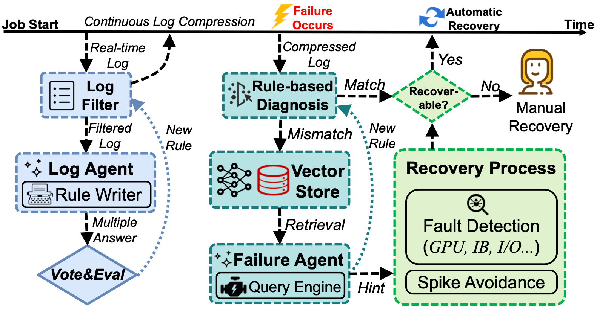

# Acme's Failure Diagnosis System

A LLM-powered tool for automated failure diagnosis and recovery in large-scale model training jobs.

The system implements the following pipeline, which is presented in paper [Characterization of Large Language Model Development in the Datacenter](https://www.usenix.org/conference/nsdi24/presentation/hu):



## Features

- **Real-time Log Processing**: Continuously monitors and processes training logs
- **Intelligent Log Filtering**: Uses LLM-generated regex patterns to filter routine log messages
- **Dual Diagnosis Approach**: Fast rule-based diagnosis with LLM fallback using RAG
- **Continuous Learning**: System learns from new failures and improves over time
- **Vector Storage**: Maintains historical failure context for better diagnosis

## Project Structure

```
failure-diagnosis-system/
├── main.py                 # Main orchestration script
├── agents.py               # LLM-powered LogAgent and FailureAgent
├── components.py           # LogFilter, RuleBasedDiagnosis, RecoveryProcess
├── config.py               # Configuration and file paths
├── models.py               # Pydantic models for structured output
├── requirements.txt        # Python dependencies
├── data/
│   └── sample_job.log      # Sample log file for simulation
├── rules/
│   ├── filter_rules.json   # Regex rules for log filtering
│   └── diagnosis_rules.json# Rules for rule-based diagnosis
└── vector_store/           # FAISS vector store for RAG
```

## Setup

1. **Install Dependencies**:
```bash
pip install -r requirements.txt
```

2. **Configure OpenAI API Key**:
Open `config.py` and set your OpenAI API key:
```python
os.environ["OPENAI_API_KEY"] = "sk-your-api-key-here"
```

Or set it as an environment variable:
```bash
export OPENAI_API_KEY="sk-your-api-key-here"
```

## Usage

Run the main simulation:

```bash
python main.py
```

Customization:

- **Models**: Adjust model names in `config.py`
- **Log Processing**: Modify chunk size and processing logic
- **Recovery Actions**: Extend `RecoveryProcess` with actual recovery procedures
- **Patterns**: Add domain-specific log patterns and error types

## How It Works

### 1. System Initialization
- Initializes LLM models
- Loads or creates FAISS vector store for RAG
- Sets up logging and rule components

### 2. Real-time Log Processing
- Processes logs in chunks to simulate real-time streaming
- Filters out routine messages using learned regex patterns
- Identifies potential issues and errors

### 3. Failure Diagnosis
- **Rule-based**: Fast diagnosis using pre-learned patterns
- **LLM-based**: RAG-powered analysis for unknown failures
- Generates structured diagnosis with recovery recommendations

### 4. Continuous Learning
- New filter rules from LogAgent analysis
- New diagnosis rules from FailureAgent findings
- Updates vector store with failure context

### 5. Recovery Process (Not implemented yet)
- Automatic recovery for recoverable failures
- Manual intervention alerts for complex issues

## Acknowledgments

Thanks to:
- The FAISS community for efficient vector similarity search capabilities
- The LangChain team for providing powerful LLM orchestration frameworks

## Citation

```bibtex
@inproceedings{295545,
    author = {Qinghao Hu and Zhisheng Ye and Zerui Wang and Guoteng Wang and Meng Zhang and Qiaoling Chen and Peng Sun and Dahua Lin and Xiaolin Wang and Yingwei Luo and Yonggang Wen and Tianwei Zhang},
    title = {Characterization of Large Language Model Development in the Datacenter},
    booktitle = {21st USENIX Symposium on Networked Systems Design and Implementation (NSDI 24)},
    year = {2024},
    isbn = {978-1-939133-39-7},
    address = {Santa Clara, CA},
    pages = {709--729},
    url = {https://www.usenix.org/conference/nsdi24/presentation/hu},
    publisher = {USENIX Association},
    month = apr
}
```

